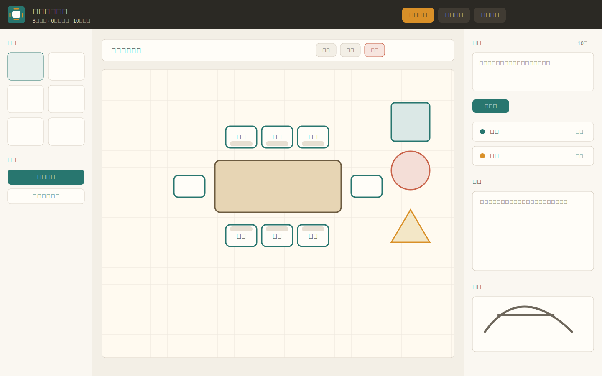

# Tableset 会议室排座

Tableset 是一个用于会议室桌椅布置和人员排座的纯前端应用。它支持绘制桌面、椅子和常用图形，导入名单后把人员拖放到座位上，并可导出图片或布局文件用于分享、存档和继续编辑。



## 功能亮点

- 画布式排版：绘制桌面、椅子、文字、矩形、圆角矩形、圆形和三角形。
- 交互编辑：选择、框选、多选、拖拽、旋转、缩放、组合、取消组合、复制、删除、撤销和重做。
- 名单排座：支持粘贴或导入 `.txt` / `.csv` 名单，单行名单可按空格、逗号、顿号、分号等自动拆分。
- 草稿辅助：导入手绘草稿作为参考图，可放大查看、缩放拖拽，并可尝试根据草稿自动生成桌椅布局。
- 导出能力：可导出 PNG 图片，也可导出 JSON 布局文件；布局文件可再次导入恢复会议室名称、布局、名单和座位分配。
- 本地保存：点击保存后会写入浏览器本地存储，刷新页面后可继续编辑。

## 快速开始

这是一个静态网页项目，不需要后端服务。

```bash
git clone https://github.com/moli-xia/tableset.git
cd tableset
```

然后直接用浏览器打开 `index.html`。如果希望用本地服务器访问，也可以运行：

```bash
python3 -m http.server 8080
```

访问 `http://localhost:8080`。

## 基本操作

1. 在左侧工具栏选择工具：`桌面` 用于绘制会议桌，`椅子` 用于添加座位，其他图形可作为讲台、门、屏幕或区域标记。
2. 在画布上拖拽创建图形；绘制矩形、圆形、三角形时按住 `Shift` 可约束为正方形、正圆或正三角形。
3. 选中元素后可直接拖动；即使当前不在“选择”工具，只要不是绘制类工具，也可以拖动已选元素。
4. 通过元素边角控制点调整大小，通过旋转工具或顶部按钮调整方向。
5. 使用 `Ctrl` / `Cmd` 点击追加或取消多选，使用“框选”工具批量选择，使用“组合”把多个元素作为整体移动。
6. 按住 `Ctrl` / `Cmd` 拖拽已选元素可快速复制。

## 名单和排座

- 在右侧“名单”文本框粘贴人员名称，点击“载入”。
- 名单既可以一行一个，也可以写成 `张三 李四 王五` 或 `张三、李四、王五`。
- 点击“自动排”会按座位位置自动分配未落座人员。
- 也可以从名单中拖拽人员到座位，或在选中座位后的属性面板中手动选择人员。
- 选中座位后可调整座位上的姓名字号和颜色；长名称会自动换行和缩放。

## 草稿功能

- 点击“导入草稿”可选择手绘草图图片作为参考底图。
- 右侧草稿预览可点击放大，放大视图中支持滚轮缩放和拖拽查看。
- “草稿自动布局”会分析当前导入的草稿图，尝试生成桌子和椅子元素；识别结果适合作为初稿，复杂草图建议生成后继续手动微调。
- “清除草稿”只移除参考图，不影响已绘制元素。

## 导入和导出

- `导出图片`：把当前布局导出为 PNG，适合发送、打印或汇报。
- `导出布局`：导出 JSON 文件，包含会议室名称、元素、名单、座位分配和草稿引用数据。
- `导入布局`：导入之前导出的 JSON 文件，恢复继续编辑。
- `清空布局`：一键清空画布和草稿，会弹窗确认；名单会保留，但座位分配会被清除。

## 快捷键

- `Delete` / `Backspace`：删除选中元素。
- `Ctrl` / `Cmd + A`：全选。
- `Ctrl` / `Cmd + C`：复制选中元素。
- `Ctrl` / `Cmd + Z`：撤销。
- `Ctrl` / `Cmd + Shift + Z` 或 `Ctrl` / `Cmd + Y`：重做。
- `Escape`：取消当前操作或关闭草稿放大视图。

## 项目结构

```text
.
├── index.html          # 页面结构
├── styles.css          # 界面样式
├── app.js              # 交互、绘制、导入导出逻辑
├── assets/
│   ├── app-icon.svg    # 应用图标和 favicon
│   └── draft-placeholder.svg
└── docs/
    └── app-screenshot.svg
```

## 兼容性

推荐使用最新版 Chrome、Edge、Safari 或 Firefox。应用主要依赖浏览器原生 SVG、Canvas、File API 和 localStorage。
